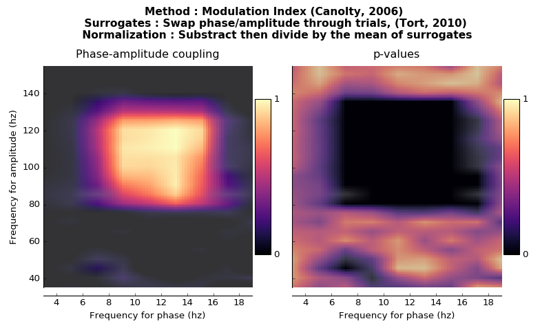
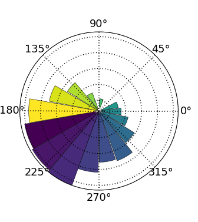
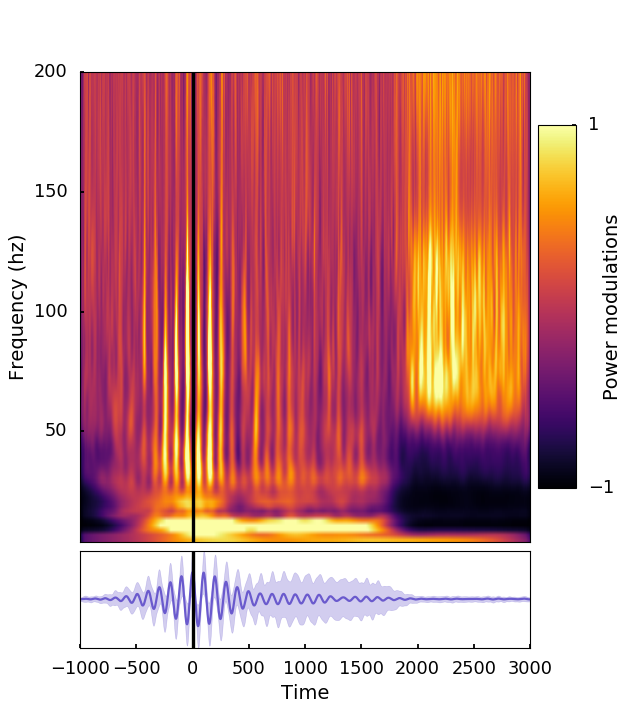
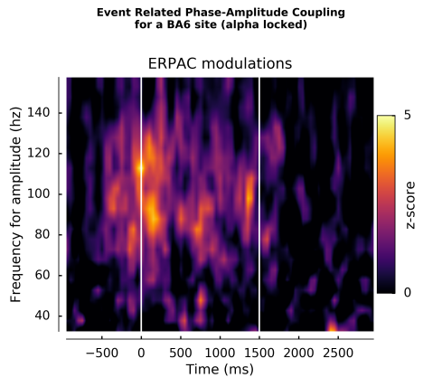
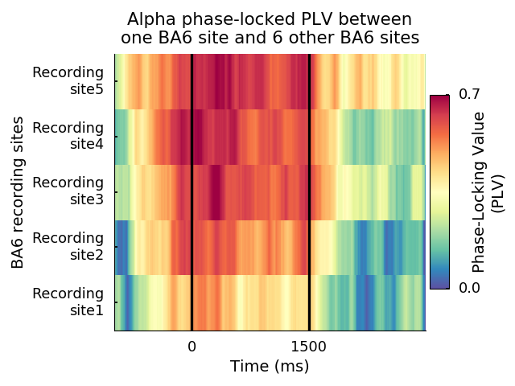

.. _pac:

Phase-Amplitude Coupling
------------------------
.. automodule:: feature
   :members: pac
   :noindex:

   Example of PAC maps for a synthetic coupled signal

.. _pp:

Prefered-phase
--------------
.. automodule:: feature
   :members: pfdphase
   :noindex:

   Example of preferred phase for an alpha-gamma coupling in BA6

.. _plp:

Phase-locked power
-------------------
.. automodule:: feature
   :members: PhaseLockedPower
   :noindex:

   Event Related Phase-Amplitude 

.. _erpac:

Event Related Phase-Amplitude Coupling
--------------------------------------
.. automodule:: feature
   :members: erpac
   :noindex:

   Event Related Phase-Amplitude Coupling

.. _plv:

Phase-Locking Value
-------------------
.. automodule:: feature
   :members: PLV
   :noindex:

   Example of an alpha PLV

