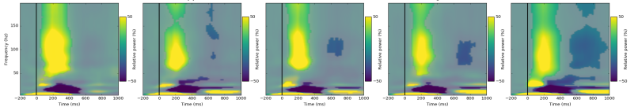
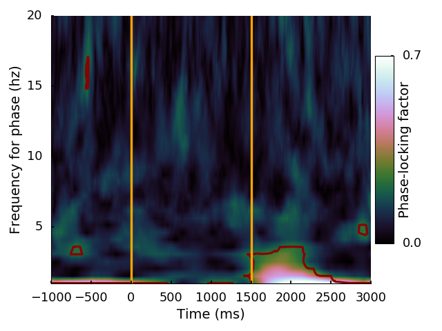

.. _sigfilt:

Filtered signal
---------------
.. automodule:: feature
   :members: sigfilt
   :noindex:

.. _amplitude:

Amplitude
---------
.. automodule:: feature
   :members: amplitude
   :noindex:

.. _power:

Power
-----
.. automodule:: feature
   :members: power
   :noindex:

.. _tf:

Time-Frequency
--------------
.. automodule:: feature
   :members: TF
   :noindex:

   Example of a Time-frequency map

.. _phase:

Phase
-----
.. automodule:: feature
   :members: phase
   :noindex:

.. _plf:

Phase-Locking Factor
--------------------
.. automodule:: feature
   :members: PLF
   :noindex:

   Example of a Phase-Locking Factor map

