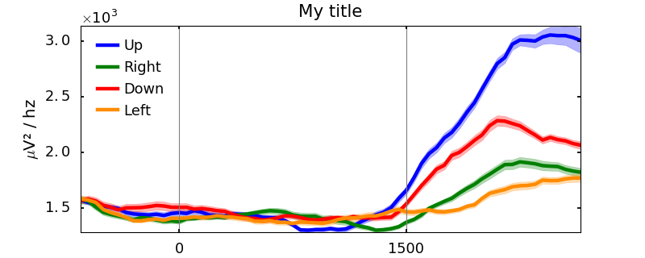
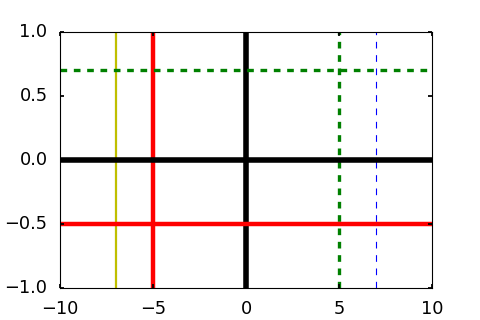

Visualization
=============

.. code-block:: python

    from brainpipe.visual import *

* :ref:`borderplt`
* :ref:`addline`

.. _borderplt:

Border plot
-----------
.. automodule:: visual
   :members: BorderPlot
   :noindex:

   Border plot example

.. _addline:

Add lines
---------
.. automodule:: visual
   :members: addLines
   :noindex:

   Quickly add some lines to your plot
