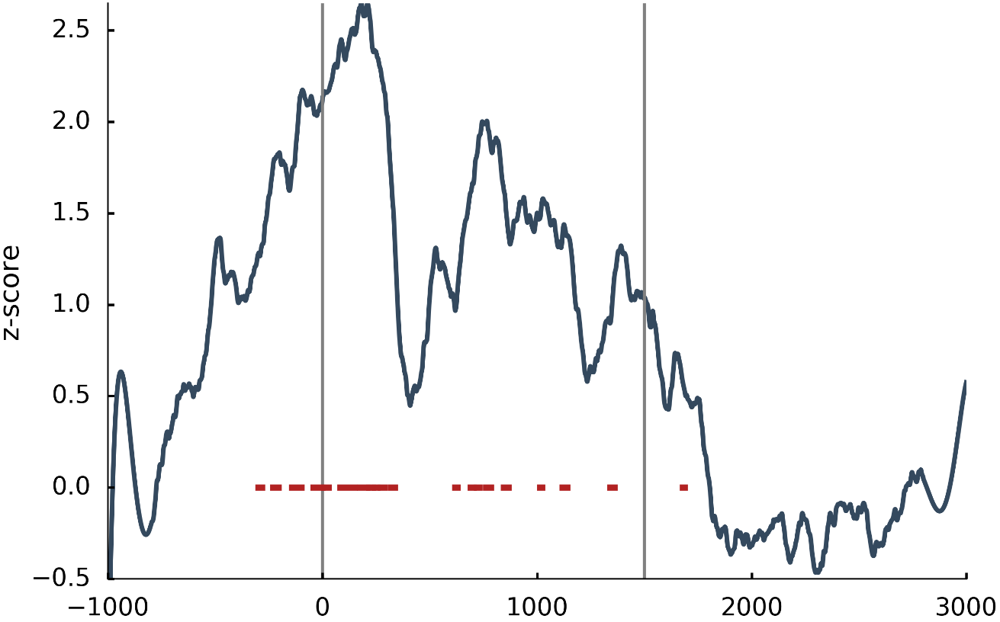
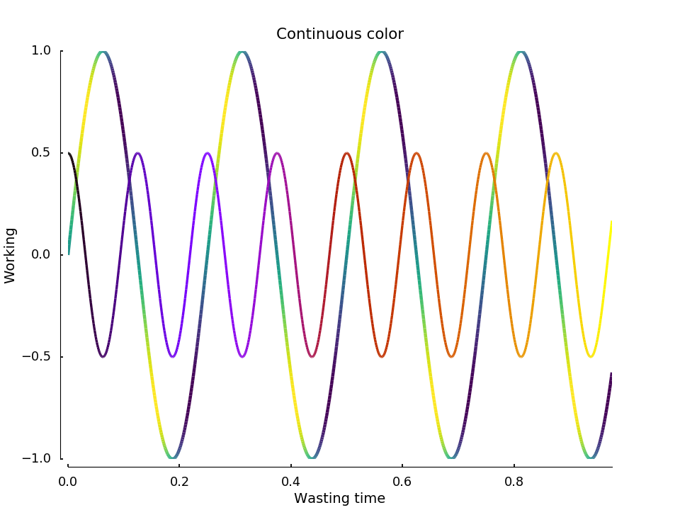
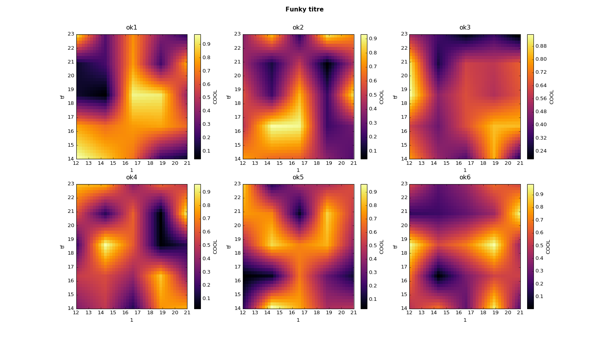

.. code-block:: python

    from brainpipe.visual import *

* :ref:`borderplt`
* :ref:`addline`
* :ref:`tilerplot`

1-D graphics
============

.. _borderplt:

Border plot
-----------
.. automodule:: visual
   :members: BorderPlot
   :noindex:

.. figure::  ../images/borderplot.png
   :align:   center

   Border plot example

.. _addline:

p-value plot
------------
.. automodule:: visual
   :members: addPval
   :noindex:

   Add p-values to an existing plot

Continuous color
----------------
.. automodule:: visual
   :members: continuouscol
   :noindex:

   Continuous color-line

1-D or 2-D graphics
===================

Add lines
---------
.. automodule:: visual
   :members: addLines
   :noindex:

.. figure::  ../images/lines.png
   :align:   center

   Quickly add some lines to your plot

.. _tilerplot:

tilerplot
---------
.. automodule:: visual
   :members: tilerplot
   :noindex:

   Automatic 1D and 2D plot

Tools
=====
.. autofunction:: visual.rmaxis

.. autofunction:: visual.despine
